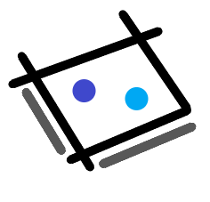

# Plateau

<p align="center">
    
</p>

[](https://github.com/orangemug/stability-badges)
[](https://gitlab.com/le-garff-yoann/plateau/pipelines)

[](https://goreportcard.com/report/github.com/le-garff-yoann/plateau)
[](LICENSE)

> Build your own board game server. Batteries included!

## Basics

The code in this repository will build the binary for the [Rock–paper–scissors](https://en.wikipedia.org/wiki/Rock%E2%80%93paper%E2%80%93scissors) game.

```bash
# Build to use the memory of the process as the store.
go build -tags="run_rockpaperscissors run_inmemory" -o dist/plateau 

# Start the server.
dist/plateau run -l :3000 --session-key my-STRONG-secret

# Build a Docker image including the frontend.
pushd vue/plateau

npm install
npm run build

popd

docker build --build-arg PACKAGING=full -t my-plateau .

# Start the server via Docker.
docker run -d -p 8080:80 -e LISTEN=80 -e SESSION_KEY=my-STRONG-secret my-plateau
```

## [Customizing](CUSTOMIZING.md)
