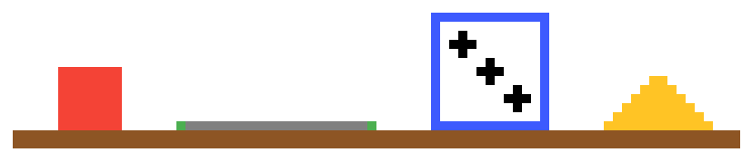

# Plateau

<p align="center">
    
</p>

[](https://github.com/orangemug/stability-badges)
[](https://gitlab.com/le-garff-yoann/plateau/pipelines)

[](https://goreportcard.com/report/github.com/le-garff-yoann/plateau)
[](LICENSE)

> Build your own board game server. Batteries included!

## Let's go

The code in this repository will build the binary for the [Rock–paper–scissors](https://en.wikipedia.org/wiki/Rock%E2%80%93paper%E2%80%93scissors) game.

**Please read [these instructions](CUSTOMIZING.md) is you want to customize *plateau* for another game.**

```bash
# Build to use the process memory as the store.
go build -tags="run_rockpaperscissors run_inmemory" -o dist/plateau 

# Start the server.
dist/plateau run -l :3000 --session-key my-STRONG-secret
```

**N.B.** Parameters to the `run` subcommand may vary function of the flags declared by `store.RunCommandSetter(*cobra.Command)` (and thus by the implementation of `store.Store`).

## A quick look at the API

```bash
BASE=http://localhost:3000
COOKIE_NAME=plateau
COOKIE_FILE=me.cookie
USERINFO='{"username":"me","password":"1234"}'

# Register yourself.
curl $BASE/user/register -d $USERINFO

# Log in.
curl $BASE/user/login --cookie-jar $COOKIE_FILE -d $USERINFO

# Create and return a match.
curl -b $COOKIE_FILE -X POST $BASE/api/matchs \
    -d '{"number_of_players_required":2}'
```

## Test Rock–paper–scissors

```bash
. helpers.bash

# Setup a match with P1 (player 1) and P2 (player 2) as participants.
tpg_setupmatch P1 P2

# Send a request from P1 and P2 perspective.
tpg_send P1 ?
tpg_send P2 ? 
# tpg_send P1 PLAY_ROCK
# tpg_send P1 PLAY_PAPER

# Show the match from the perspective of P1.
tpg_match P1

# Show the deals of the matchs from the perspective of P1.
tpg_deals P1
```

## Frontend

Take a look [here](vue/plateau/).
