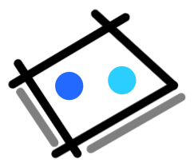

# Plateau

<p align="center">
    
</p>

[](https://github.com/orangemug/stability-badges)
[](https://gitlab.com/le-garff-yoann/plateau/pipelines)

[](https://goreportcard.com/report/github.com/le-garff-yoann/plateau)

> Build your own board game server. Batteries included!

## Basics

The code in this repository will build the binary for the [Rock–paper–scissors](https://en.wikipedia.org/wiki/Rock%E2%80%93paper%E2%80%93scissors) game.

### Build and run via Docker Compose

1. [Install Docker Compose](https://docs.docker.com/compose/install).
2. 
```bash
cd docker/

PLATEAU_SESSION_KEY=my-STRONG-secret \
    docker-compose up -d

docker rmi $(docker images -qf dangling=true -f label=autodelete=true)
```

| ENV | Mandatory? | Default value |
|-|-|-|
| `PLATEAU_GO_GAME_TAG` | ☓ | rockpaperscissors |
| `PLATEAU_LISTEN_PORT` | ☓ | 80 |
| `PLATEAU_SESSION_KEY` | ✓ | |
| `PLATEAU_POSTGRESQL_USER` | ☓ | pg |
| `PLATEAU_POSTGRESQL_PASSWORD` | ☓ | pg |

## [Customizing](CUSTOMIZING.md)
